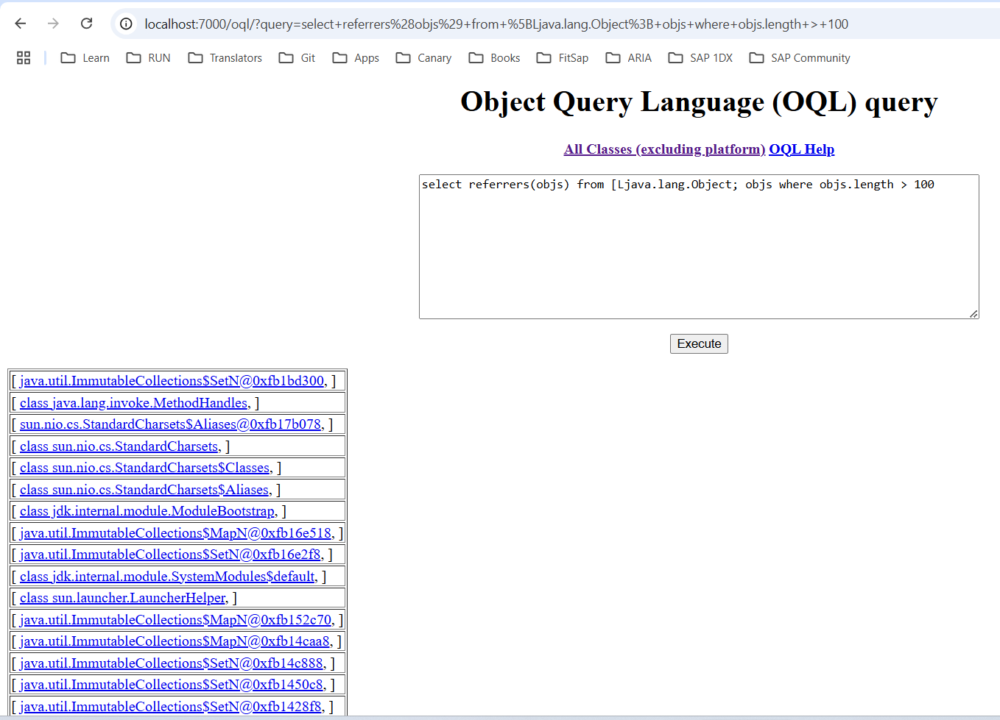
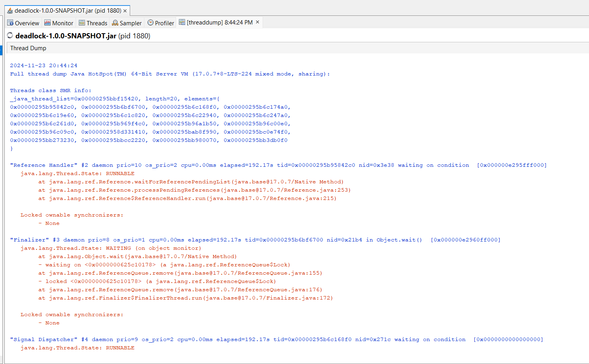

## Quiz
#### Prepare answers to following questions:
* Which interface JDK tools use to connect to JVM locally?
VisualVM, jcmd, jmap, jhat, jstack, jconsole, Java Mission Control, jinfo
* What is difference between profiling and traceability?
Profiling is the process of measuring an application or system by running an analysis tool called a profiler. 
Profiling tools can focus on many aspects: functions call times and count, memory usage, cpu load, and resource usage. 
Tracing is a specialized use of logging to record information about a program's execution.
## OutOfMemory (OOM) error troubleshooting
#### Get OOM error
Execute and press any key:
```
    java -jar -Xmx100m heap-1.0.0-SNAPSHOT.jar
```

#### Use jvisualvm to observe OOM
- Execute:

```
    java -jar -Xmx100m heap-1.0.0-SNAPSHOT.jar
```
- In jvisualvm connect to our java process
- Go to "Monitor" tab
- Press any key in our application
- Observe how heap grows

###### Result:


#### Get heap dump
##### Using -XX:+HeapDumpOnOutOfMemoryError option
- Execute and press any key:

```
    java -jar -Xmx100m -XX:+HeapDumpOnOutOfMemoryError heap-1.0.0-SNAPSHOT.jar
```
###### Result:
File java_pid25088.hprof is generated

##### [Optional] Using jcmd
Get pid using `jps` here and further through this document:
```
    jps -lvm
```
```
    jcmd <pid> GC.heap_dump <filename>
```

###### Result:
File java_pid20248_jcmd.hprof is generated

##### [Optional] Using jmap
```
    jmap -dump:format=b,file=snapshot.hprof <pid>
```

###### Result:
File snapshot_jmap.hprof is generated

#### Get heap histogram
##### Using jcmd
```
    jcmd <pid> GC.class_histogram
```

###### Result:
History is stored in HistogramResultJmcd.txt file

##### Using jmap
```
    jmap -histo <pid> 
```

###### Result:
History is stored in HistogramResultJmap.txt file

#### Analyze heap dump
##### Using Java Visual VM
- Open retrieved heap dump in jvisualvm
- Identify memory leak

###### Result:


##### OQL
Execute OQL in jvisualvm:
```
    select objs from java.lang.Object[] objs where objs.length > 100
    select referrers(objs) from java.lang.Object[] objs where objs.length > 100
    select referrers(arr) from java.util.ArrayList arr where arr.size > 100
```

###### Result:


Startup `jhat` (note: `jhat` was decommissioned in JDK 9)
```
    jhat <head_dump.hprof>
```

###### Result:


Execute OQL in jhat
```
    select [objs, objs.length] from [Ljava.lang.Object; objs where objs.length > 100
    select referrers(objs) from [Ljava.lang.Object; objs where objs.length > 100
    select referrers(arr) from java.util.ArrayList arr where arr.size > 100
```
Please note small OQL syntax difference in jhat and jvisualvm.

###### Result:




##### _Conclusion:_
- OutOfMemoryError was thrown in com.epam.jmp.mat.heap.Process class
- There is an ArrayList field which has many elements, and it causes this error

- To solve this error, we should refactor this class and adjust logic how this list is used

## Deadlock troubleshooting
#### Get deadlock
- Execute java application that simulates deadlock:

```
    java -jar deadlock-1.0.0-SNAPSHOT.jar
```

- Get thread dump and locate lines similar to:

```
Found one Java-level deadlock:
=============================
"Thread 2":
  waiting to lock monitor 0x000000001bf40b68 (object 0x000000076b7777c8, a java.lang.Object),
  which is held by "Thread 1"
"Thread 1":
  waiting to lock monitor 0x000000001bf43608 (object 0x000000076b7777d8, a java.lang.Object),
  which is held by "Thread 2"

Java stack information for the threads listed above:
===================================================
"Thread 2":
        at com.epam.jmp.mat.deadlock.SimulateDeadLock.method2(SimulateDeadLock.java:44)
        - waiting to lock <0x000000076b7777c8> (a java.lang.Object)
        - locked <0x000000076b7777d8> (a java.lang.Object)
        at com.epam.jmp.mat.deadlock.DeadLockMain$2.run(DeadLockMain.java:18)
"Thread 1":
        at com.epam.jmp.mat.deadlock.SimulateDeadLock.method1(SimulateDeadLock.java:24)
        - waiting to lock <0x000000076b7777d8> (a java.lang.Object)
        - locked <0x000000076b7777c8> (a java.lang.Object)
        at com.epam.jmp.mat.deadlock.DeadLockMain$1.run(DeadLockMain.java:11)

Found 1 deadlock.
```

#### Get thread dump
1} jstack
```
    jstack -l <pid>
```

###### Result:
Thread dump is stored in ThreadDump.txt file

2} kill -3
```
    kill -3 <pid>
```
3} jvisualvm

###### Result:



4} Windows (Ctrl + Break)

5} jcmd
```
    jcmd <pid> Thread.print
```

###### Result:
Thread dump is stored in ThreadDump_jcmd.txt file

## Remote JVM profiling
Using [JMX Technology](https://docs.oracle.com/javase/8/docs/technotes/guides/management/agent.html)

For insecure remote connection use parameters:
```
    -Dcom.sun.management.jmxremote
    -Dcom.sun.management.jmxremote.port=7890
    -Dcom.sun.management.jmxremote.authenticate=false
    -Dcom.sun.management.jmxremote.ssl=false
```
```
    java -jar -Dcom.sun.management.jmxremote -Dcom.sun.management.jmxremote.port=7890 -Dcom.sun.management.jmxremote.authenticate=false -Dcom.sun.management.jmxremote.ssl=false simple-1.0.0-SNAPSHOT.jar
```
Connect to JVM using jconsole:
```
    jconsole localhost:7890
```

###### Result:


## Inspect a Flight Recording
Execute JVM with two special parameters:
```
    -XX:+UnlockCommercialFeatures
    -XX:+FlightRecorder
```
```
    java -jar -Xmx100m -XX:+UnlockCommercialFeatures -XX:+FlightRecorder -XX:StartFlightRecording=dumponexit=true,filename=flight.jfr heap-1.0.0-SNAPSHOT.jar
```

Result:

When I remove -XX:+UnlockCommercialFeatures:


Enable Flight Recording on JVM without these parameters:
```
    java -jar -Xmx100m -XX:+UnlockCommercialFeatures heap-1.0.0-SNAPSHOT.jar
    jps -lvm
    jcmd <pid> JFR.start name=heap_recording filename=flight.jfr dumponexit=true
```
Open Java Mission Control and connect to default HotSpot of our JVM:
```
    jmc
```
`cd C:\Users\Yuliya_Seliukova\Downloads\jmc-9.0.0_windows-x64\jmc-9.0.0_windows-x64\JDK Mission Control
jmc -vm "C:\Program Files\Java\jdk-17\bin"`


## jinfo
Print system properties and command-line flags that were used to start the JVM.
```
    java -jar simple-1.0.0-SNAPSHOT.jar
    jps
    jinfo <pid>
```

###### Result:

Info is stored in jinfo.txt file

## Practical task evaluation rules:
* OOM errors troubleshooting : 30 points
* Deadlock troubleshooting : 30 points
* Remote JVM profiling : 20 points
* FlightRecorder : 20 points

